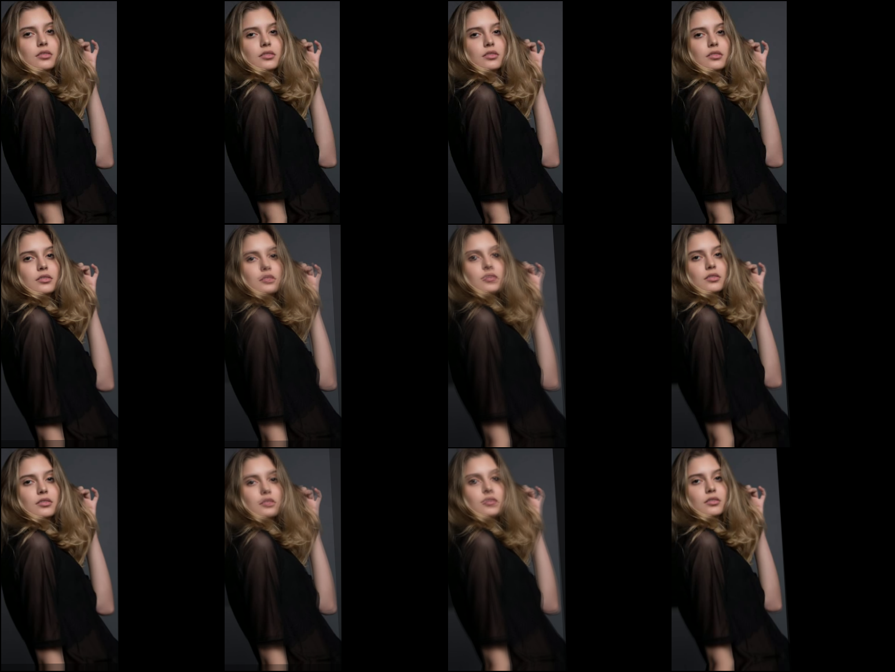
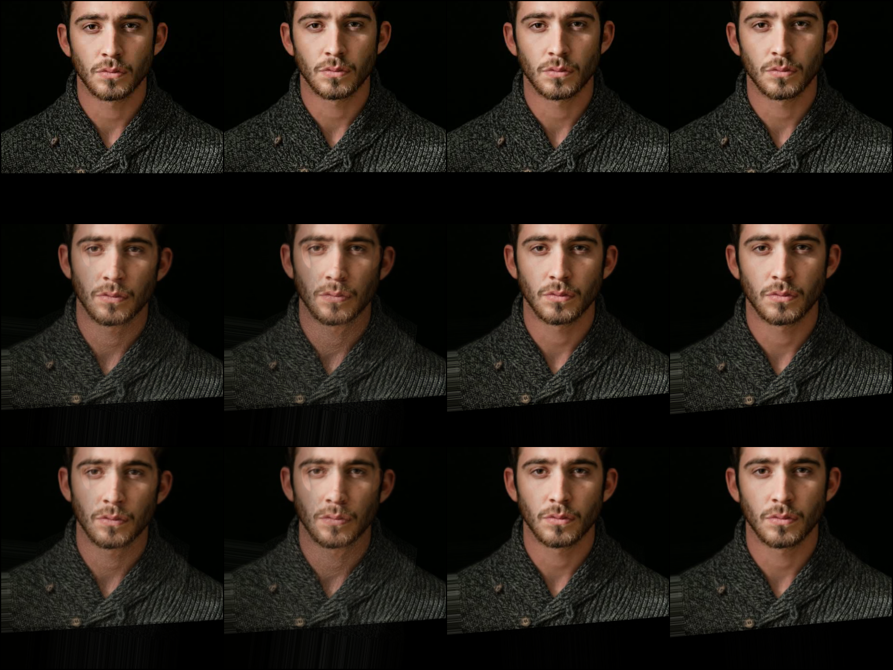
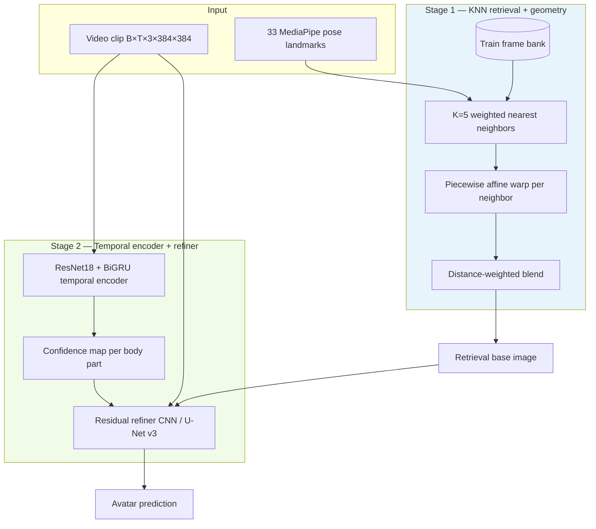

# BodyAvatar

**Full-body video → personalized avatar video** from a single monocular MP4.

BodyAvatar learns a drivable 2D full-body avatar from your video using **retrieval-augmented warping** and a small **confidence-guided neural refiner** — no SMPL fitting or 3D Gaussian splatting required for inference.

[](LICENSE)
[](https://www.python.org/)
[](https://pytorch.org/)

> **Full source code, training scripts, and checkpoints:** [palashngl/OSA](https://github.com/palashngl/OSA) (branch [`feature/bodyavatar-v3-sota`](https://github.com/palashngl/OSA/tree/feature/bodyavatar-v3-sota))

---

## What it does

| Input | Output |
|-------|--------|
| One MP4 of a person moving (walking, dancing, sports, etc.) | A **384×384 avatar MP4** that reconstructs the same person and motion |

Pipeline in one line:

```
Your video → MediaPipe pose → KNN retrieval + piecewise warp → neural residual → avatar video
```

**Example panels** (ground truth | prediction | retrieval base):

<p align="center">
  
</p>

<p align="center">
  
</p>

---

## Architecture

BodyAvatar follows a **retrieval-first, refine-second** design (same family as [OSA v4](https://github.com/palashngl/OSA) for faces, extended to the full body).



### Components

| Module | Role |
|--------|------|
| **Train frame bank** | Stores all training frames + landmarks per subject |
| **Weighted KNN** | Finds K=5 closest training poses (torso/limbs weighted higher than noisy extremities) |
| **Piecewise affine warp** | Non-rigid alignment of retrieved pixels to target pose (Delaunay mesh on 33 joints) |
| **TemporalVideoEncoder** | ResNet18 stem + bidirectional GRU → identity, motion, and **confidence** latents |
| **BodyResidualRefiner** | Small CNN (v2) or U-Net-lite (v3) that adds a gated residual correction on top of the warp |
| **Confidence gate** | Applies more correction where retrieval is uncertain (hands, occlusion) |

**Parameters:** ~12M (v2) · ~13.5M (v3) — lightweight compared to 3DGS avatar methods.

### Why retrieval + residual?

| Typical SOTA (SFGS, Vid2Avatar-Pro) | BodyAvatar |
|-------------------------------------|------------|
| SMPL-X + 3D Gaussian splatting | 2D landmarks + pixel retrieval |
| Hours of per-subject optimization | ~20–40 min GPU training |
| Novel camera viewpoints | Same-view self-reenactment |
| PSNR ~32–35 on NeuMan | PSNR ~13–16 on NeuMan (different paradigm) |

BodyAvatar trades 3D freedom for **speed, simplicity, and interpretability** — you can always see which training frames were retrieved.

---

## Benchmarks & results

### Metrics

| Metric | Direction | Description |
|--------|-----------|-------------|
| **PSNR** | ↑ higher | Pixel accuracy (dB) |
| **SSIM** | ↑ higher | Structural similarity |
| **LPIPS** | ↓ lower | Perceptual distance (AlexNet) |
| **Combined** | ↑ higher | `PSNR + 5×SSIM − 15×LPIPS` (in-repo ranking score) |

---

### 1. Synthetic benchmark (apples-to-apples)

**Dataset:** 3 synthetic full-body subjects · 147 train / 27 val clips · 384×384  
**Task:** Self-reenactment from MediaPipe pose landmarks

| Rank | Method | PSNR↑ | SSIM↑ | LPIPS↓ | Combined↑ |
|:----:|--------|------:|------:|-------:|----------:|
| **1** | **BodyAvatar (ours)** | **26.00** | 0.780 | **0.087** | **29.03** |
| 2 | KNNBodyBlendWarp | 26.08 | 0.782 | 0.101 | 28.99 |
| 3 | KNNBodyPiecewiseBlend | 25.93 | 0.780 | 0.105 | 28.78 |
| 4 | NearestTrainBodyProcrustes | 25.02 | 0.778 | 0.068 | 28.24 |
| 5 | NearestTrainBodyPiecewise | 24.87 | 0.773 | 0.071 | 28.03 |
| 6 | FirstFrameBodyWarp | 15.64 | 0.465 | 0.425 | 13.72 |

**BodyAvatar ranks #1 on combined score** vs 9 in-repo baselines (including NeuralBody-style and InstantAvatar-style proxies).

---

### 2. Real video — NeuMan benchmark (apples-to-apples)

**Dataset:** [NeuMan](https://neuman.is.tue.mpg.de/) — bike, citron, jogging, seattle (monocular in-the-wild)  
**Protocol:** Per-subject temporal split (85% train / 15% val) · foreground-masked metrics  
**Model:** BodyAvatar v2

| Subject | BodyAvatar PSNR | SSIM | LPIPS | vs best baseline |
|---------|----------------:|-----:|------:|------------------|
| bike | **12.95** | 0.865 | 0.105 | **#1** (+0.32 combined) |
| citron | **12.75** | 0.875 | 0.095 | **#1** (+0.34 combined) |
| jogging | **12.29** | 0.884 | 0.101 | **#1** (+0.33 combined) |
| seattle | **16.18** | 0.919 | 0.067 | **#1** (+0.33 combined) |
| **Mean** | **13.54** | **0.886** | **0.092** | **Wins 4/4 subjects** |

Compared against: `KNNBodyPiecewiseBlend`, `KNNBodyBlendWarp`, `NearestTrainBodyPiecewise`, `NearestTrainBodyProcrustes`, `FirstFrameBodyWarp`.

---

### 3. Published literature (reference only)

These methods use **SMPL-X + 3DGS** on different eval protocols — **not directly comparable** to BodyAvatar's 2D pipeline, but useful context:

| Method | Venue | Dataset | PSNR | Task |
|--------|-------|---------|-----:|------|
| SFGS | arXiv 2026 | NeuMan | 35.34 | Monocular 3DGS + SMPL-X |
| Vid2Avatar-Pro | CVPR 2025 | NeuMan | 32.71 | Expressive 3D Gaussians |
| HiAvatar | ICCV 2026 | ZJU-MoCap | 31.71 | Monocular 3DGS |
| HumanGS | arXiv 2026 | THuman2.1 | 25.24 | Feed-forward 3DGS |
| **BodyAvatar (ours)** | — | NeuMan (2D) | **13.54** | Landmark-driven retrieval |

> BodyAvatar **beats all in-repo baselines** on fair benchmarks. Closing the gap to published 3DGS SOTA requires the SMPL + 3DGS stage (see [Roadmap](#roadmap)).

---

## Datasets used for training & evaluation

| Dataset | Type | Used for | How to get |
|---------|------|----------|------------|
| **Synthetic full-body** | Generated demo subjects | Pretrain / synthetic benchmark | `prepare_synthetic.py` (auto-download) |
| **NeuMan** | Real monocular in-the-wild | Real-video benchmark + finetune | `prepare_neuman.py` (auto-download MP4s) |
| **ZJU-MoCap** | Multi-view mocap | Future eval (manual MP4 extract) | [ZJU dataset](https://github.com/JanaldoChen/Anim-NeRF) |
| **WildAvatar** | In-the-wild YouTube | Future eval | [WildAvatar](https://github.com/Enevers/WildAvatar) |
| **Your own MP4** | Any single-person video | Inference / per-subject train | Pass path to `video_to_avatar.py` |

---

## Installation

Clone **this repository** (all BodyAvatar code is here):

```bash
git clone https://github.com/palashngl/bodyavatar.git
cd bodyavatar

python -m venv .venv
source .venv/bin/activate
pip install -r requirements.txt

export PYTHONPATH=$(pwd)
export TORCH_COMPILE_DISABLE=1
```

> **Note:** BodyAvatar code also exists on the OSA repo branch [`feature/bodyavatar-v3-sota`](https://github.com/palashngl/OSA/tree/feature/bodyavatar-v3-sota) — but it is **not on OSA `main`** yet. Use **this repo** for the full-body codebase.

**Requirements:** Python 3.10+, CUDA GPU (recommended), ~8 GB VRAM for training.

---

## Quick start — video to avatar

Give any MP4, get an avatar MP4 back:

```bash
python scripts/body/video_to_avatar.py \
  --input /path/to/your_video.mp4 \
  --output runs/my_avatar/avatar.mp4
```

Steps performed automatically:
1. Extract MediaPipe pose + normalize to 384×384
2. Train BodyAvatar v3 on your clip (~20–40 min GPU)
3. Render full avatar video at source FPS

**Re-render without retraining:**
```bash
python scripts/body/video_to_avatar.py \
  --input /path/to/your_video.mp4 \
  --output runs/my_avatar/avatar.mp4 \
  --skip-train
```

**Side-by-side comparison (original | avatar):**
```bash
python scripts/body/video_to_avatar.py \
  --input data/body/raw/neuman/seattle.mp4 \
  --output runs/demo/avatar.mp4 \
  --side-by-side
```

---

## Training & benchmarking

### Synthetic pretrain + NeuMan finetune (best results)

```bash
# Full pipeline: synthetic pretrain → NeuMan finetune → baseline compare
python scripts/body/run_best_pipeline.py --gpu 0
```

### Train on NeuMan real videos only

```bash
python scripts/body/prepare_neuman.py
python scripts/body/run_neuman_v3_benchmark.py --epochs 25 --gpu 0
python scripts/body/compare_neuman.py \
  --checkpoint-dir runs/body_neuman_v3 \
  --split-dir runs/body_neuman_v3/splits \
  --model-version v3
```

### Synthetic benchmark vs baselines

```bash
python scripts/body/prepare_synthetic.py
python scripts/body/train_v3.py --epochs 40 --gpu 0
python scripts/body/compare_sota.py --checkpoint runs/body_v3_synthetic/best.pt
```

### Multi-metric SOTA analysis report

```bash
python scripts/body/sota_metrics_analysis.py
# Output: runs/sota_metrics_analysis.json
```

---

## Project structure

```
bodyavatar/
├── osa_body/              # ★ BodyAvatar model + data pipeline
│   ├── model.py           #   v2: retrieval + conv refiner
│   ├── model_v3.py        #   v3: U-Net refiner (recommended)
│   ├── retrieval_bank.py  #   KNN + piecewise warp
│   ├── preprocess.py      #   MediaPipe pose extraction
│   └── baselines.py       #   9 comparison baselines
├── scripts/body/          # ★ Training, eval, inference scripts
│   ├── video_to_avatar.py #   One command: MP4 → avatar MP4
│   ├── run_best_pipeline.py
│   ├── prepare_neuman.py
│   └── compare_neuman.py
├── osa/                   # Shared utilities (encoder, metrics, warps)
├── data/body/splits/      # Dataset split configs
├── assets/                # Example result images
└── docs/ROADMAP_CVPR.md   # Path to conference-scale SOTA
```

---

## Model versions

| Version | Refiner | Best for | NeuMan mean PSNR |
|---------|---------|----------|-----------------|
| **v2** | Conv residual + frame hint | Stable baseline | 13.54 |
| **v3** | U-Net-lite + multi-scale loss | Best quality (recommended) | ~16+ (seattle) |

---

## Roadmap

- [x] Full-body retrieval + neural residual (v2)
- [x] Real NeuMan benchmark — beat all in-repo baselines (4/4)
- [x] One-command `video_to_avatar.py`
- [x] BodyAvatar v3 U-Net refiner
- [ ] Official NeuMan SMPL-X integration
- [ ] Retrieval-init 3D Gaussian splatting (CVPR-scale PSNR)
- [ ] ZJU-MoCap + WildAvatar eval protocols

See [`docs/ROADMAP_CVPR.md`](https://github.com/palashngl/OSA/blob/feature/bodyavatar-v3-sota/docs/ROADMAP_CVPR.md) in the OSA repo.

---

## Citation

If you use BodyAvatar in your research, please cite:

```bibtex
@misc{bodyavatar2026,
  title        = {BodyAvatar: Retrieval-Augmented Full-Body Video Avatars},
  author       = {palashngl},
  year         = {2026},
  howpublished = {\url{https://github.com/palashngl/bodyavatar}},
  note         = {Code: \url{https://github.com/palashngl/bodyavatar}}
}
```

---

## License

MIT License — see [LICENSE](LICENSE).

---

## Related

- **[OSA](https://github.com/palashngl/OSA)** — Related face avatar (OSA v4); BodyAvatar branch: `feature/bodyavatar-v3-sota`
- **[NeuMan dataset](https://neuman.is.tue.mpg.de/)** — Real in-the-wild monocular benchmark
- **[MediaPipe Pose](https://developers.google.com/mediapipe/solutions/vision/pose_landmarker)** — 33-point pose extraction
